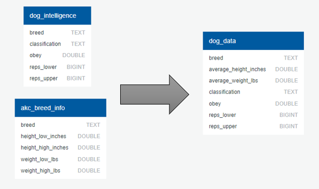

# ETL-Dog-Intelligence

## Overview
COVID-19's effects in the U.S. can be seen in almost all industries and areas of life, from changes in the way we work and travel to how we shop. One of the most surprising, yet understandable changes that have occurred is the surge in dog adoptions.
                    
The Washington Post reported that increased consumer demand has even led to waiting lists for certain breeds of dogs. With so much interest in adopting these four-legged-pals, our team got together to compare dog breed height/weight and intelligence with the hopes of helping others with selecting their future best friends.
    		
Dog intelligence is determined by the aptitude demonstrated for obeying the first command (we will refer to this as the obedience ratio), and the repetition needed for a dog to understand a new command. Why is dog intelligence important? This dictates the approximate speed at which a dog will learn a new command and their track-record in obeying commands given, which can greatly reduce training time. Training is integral so that your new furry friend becomes acclimated to their new home, understands their place in the household, as well as their boundaries and expectations.
    			
**Regardless of their obedience level, all dogs do have the ability to learn and obey commands**, it just may take more investment from their owner in the form of time and repetition. Intelligence is not the only factor that should be considered in the adoption process, please also consider breed-specific dog behaviors and health issues.
We hope that our data insights will help individuals and families seeking a furry best friend to approximate the time investment needed to train their new family member. Dog training will encourage desirable behaviors that will contribute to a happy life for the entire family.

Our ETL site may be accessed at **[https://alissavokes.github.io/ETL-Dog-Intelligence/](https://alissavokes.github.io/ETL-Dog-Intelligence/)**.

## Research Questions
1. Identify if there is a relationship between breed size and intelligence.
2. Top 5 smartest large dog breeds.
3. Top 5 smartest small dog breeds.
4. Top ten dog breeds by intelligence.
5. Average intelligence across all breeds based on dog weight.
    
    Small dogs < 35 lbs
    
    Medium breeds - between 35 and 65 lbs
    
    Large dogs > 65 lbs
    
## ETL Process
The [data_etl.ipynb](https://github.com/alissavokes/ETL-Dog-Intelligence/blob/master/ETL%20process/data_etl.ipynb) may be referred to for our ETL process.

### Extract
Our original data sources were formatted as CSV files. Both data sets were obtained from [data.world](https://data.world/len/dog-size-intelligence-linked), and have been included below.

[Dog Intelligence-Obedience](https://data.world/len/intelligence-of-dogs)
[AKC Breed Measurements](https://data.world/len/dog-canine-breed-size-akc)

### Transform
Once the data was reviewed, we identified a few issues that we needed to address in the data cleaning step, such as breed name inconsistencies, and missing/invalid values.

Using Pandas, the following steps were taken to address the identified issues.

* The obedience rate for low degree of working/obedience intelligence category dogs was updated to reflect a numerical value of 0% to replace the imported NaN values.
* The obedience rate was changed into a decimal value column to facilitate SQL importation.
* Dog names were replaced in both CSV files where they were inconsistent (22 entries)
* Dogs with no size information were dropped from the dataset.
* The value counts function was used to identify height data that was not valid (such as "not found" and "na" values), which were then converted to NaN and dropped.
* The column titles were changed to lower case for consistency.
* Height and weight column data types were transformed using the to_numeric Pandas function.
* The mean weight and height for each breed were calculated based on the low and high ranges provided by the original data set.

### Load
Once the cleaning was finalized, a PostgreSQL connection was initiated and the cleaned tables were loaded into the database. The tables were then merged using a SQL command and exported as a CSV file. This table may be found in the "Final Table" section of our website.

Our group determined to merge the two tables into one in order to simplify our approach to pulling and evaluating information.

## Data Analysis
Dog size factors, such as height and weight, and intelligence (in the form of the obedience ratio) were compared. The top 10 most intelligent breeds reflect dog weights that range from less than 10 lbs and up to 100 lbs. The results indicate that intelligence is derived from other breed-specific variables. We concluded that there is not a strong correlation between average breed size and intelligence as a variety of dog breeds of all sizes were found in each intelligence category.

# Questions Answered
### Top 5 smartest large dog breeds.

### Top 5 smartest small dog breeds.

### Top ten dog breeds by intelligence.

### Average intelligence across all breeds based on dog weight.

The results indicate that medium-sized dog breeds have a higher level of intelligence on average when compared to large and small dog breeds.